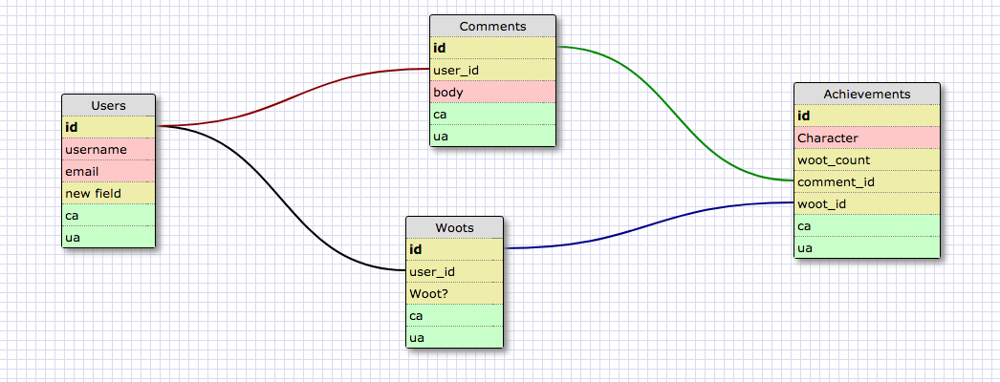

# Guild-Crier
An Application to handle and interact with Wow Guild Notifications

## User Stories
As a user, I will be able to visit the app and see the Dancing Panada's most recent Guild news.  This includes personal and guild achievements, as well has high level loot acquired.  As a user, I'll be able to register and log in.  If I'm logged in, I'll be able to interact with each achievement, including commenting and giving one (or more) woots! (aka likes) to the achievement.  

### Stretch
Some stretch goals:

Incorporate Blizzard's Auth so the user can log in with their Blizzard information.
Enable push notifications of some kind for new achievements.
Include a dynamic guild roster list/page.

## Current Schema

